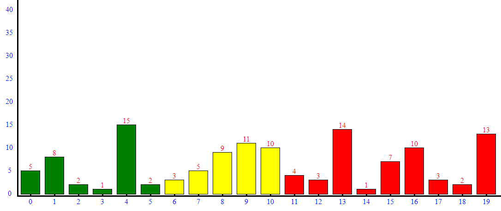

# Test project for Fairfly

I'll start with the main files:

- `index.html`
- `style.css`
- `fonts.css`
- `animation.js`

There are also img and icons folders, 
which store pictures and icons, respectively

Looking at the website layout in Photoshop,
I immediately divided it into 8 parts:

1. `<header id="home__" class="menu-bar">...</header>` 
    this is the site header
    
2. `
...
` 
    section 'about us' or 'our story'
    
3. `
...
` 
    section 'expertise'
    
4. `
...
` 
    section 'teams'
    
5. `
...</div` 
    section 'works'
    
6. `
...
` 
    section 'people say'
    
7. `
...
` 
    section 'contact'
    
8. `
...
` 
    section 'footer'
    
`Anchors` from the main menu are attached to all sections, except for the last one.

I used `bootstrap` library and `media` requests to create responsive. 
I connected the `bootstrap` library in the header, as a css file in front
of my styles and at the end of the body tag in front of my javascript file.

The `style.css` file contains the styles for this project, and `fonts.css` - the fonts
that I downloaded from the Internet.

`animation.js` contains the code that helped me make a responsive menu.

##Bar charts

I also added a `third` task to this project,
in which it was necessary to display a graph for a given array.
I commented out the whole file right in the code, but I will write a few words here too.

#####This is the result of doing the third task in a browser without using third-party libraries, canvas and svg

I created an empty div in which I planned to display the graph as blocks added through a loop using `innerHTML`.
 At the bottom, I displayed the indices of the elements of a given array, on the left, a value scale for beauty,
  and at the top of each block of the chart, for clarity, I displayed the value in the array.
  
folder `third task` contains files with 3rd task